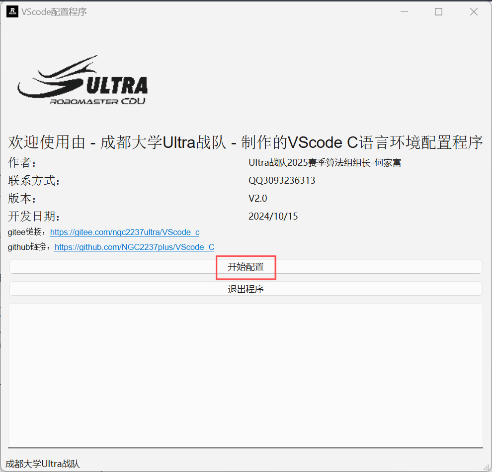
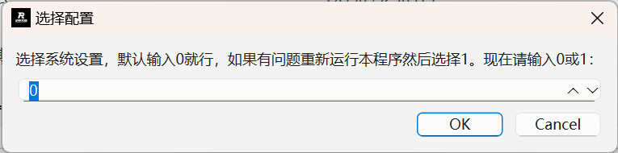
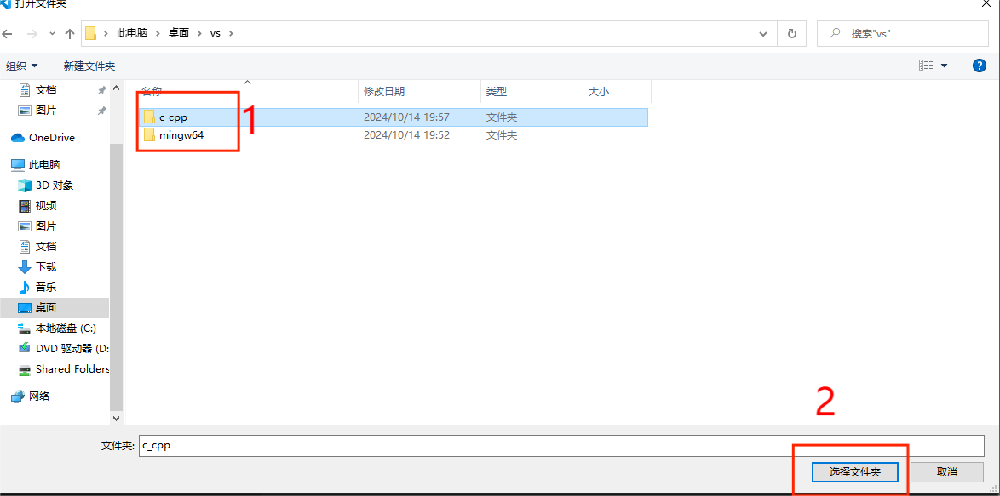
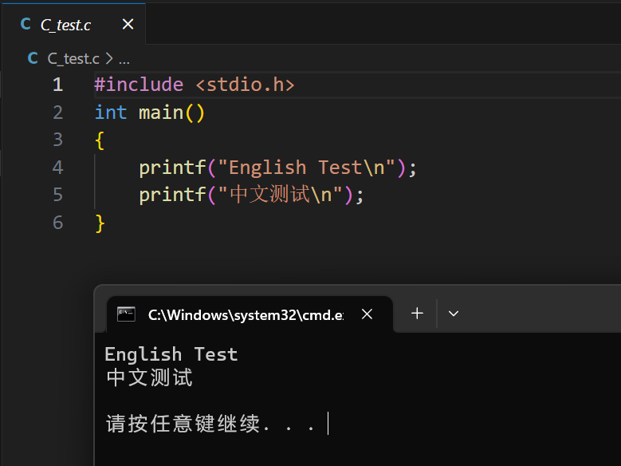

# vscode C语言环境配置

python+pyqt6开发，快捷配置vscode的C语言环境

 

  <h3 align="center">“vscode环境自动配置”</h3>
  

    快捷配置vscode的C语言环境
     
    <a href="https://gitee.com/ngc2237ultra/VScode_c"><strong>项目</strong></a>
     
     
    ·
    <a href="https://gitee.com/ngc2237ultra/VScode_c/issues">报告Bug</a>
    ·
    <a href="https://gitee.com/ngc2237ultra/VScode_c/issues">提出新特性</a>
  

## 上手指南

- 目前只支持Windows   
- 确保使用管理员身份运行   
- 不要随意修改路径

#### 下载zip压缩包  
  

   

#### 本地解压   
1.不要有中文路径   
2.自行选择解压位置   

#### 安装vscode（已安装跳过）
1.双击安装，如果需要其他版本可以从官网下载https://code.visualstudio.com/   
   

2.选择“同意”   
   

3.全部打勾   
   

4.搜索chinese安装中文插件，安装完成右下角会提示重启，重启即可。    
如果还是英文，找度娘。   
   

5.同理，安装以下插件   
   

#### 启动配置程序
1.以管理员身份运行“vscode_auto_v2.0”   
   

2.点击“是”   
   

3.程序启动后，点击“确认配置”   
   

4.根据提示选择   
   

5.没有错误提示就是配置成功   
   

<h1 align="center" style="color: red; font-size: 2.5em;">配置完成建议重启电脑！</h1>   
   
#### 测试
1.打开“c_cpp”文件夹   
- 方法一:   
右键文件夹，选择“通过code打开”   
   

- 方法二：   
vscode软件左上角选择“文件” -> “打开文件夹”   
   

找到文件夹后打开   

2.选择一个文件，c是C语言，cpp是c++，在右上角选择“运行”   
   

3.选择“(Windows) Launch”   
   

4.运行成功   
   
#### 作者
[早上坏](https://gitee.com/ngc2237ultra)   
#### 联系方式   
QQ：3093236313   
邮箱：star32349@outlook.com